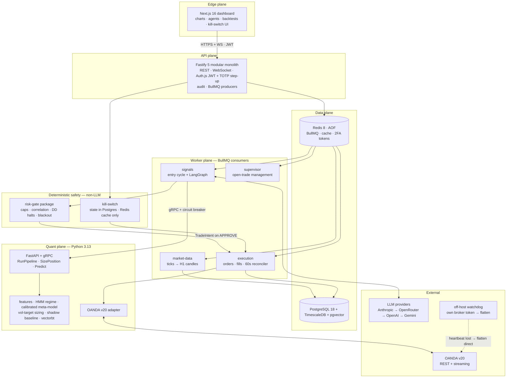
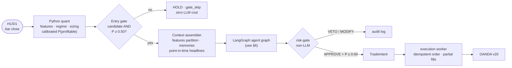
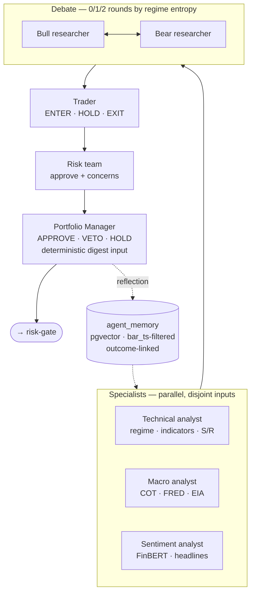
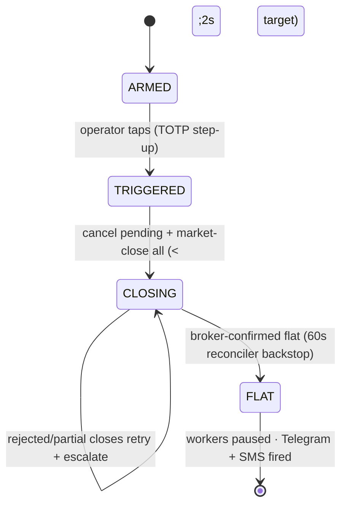
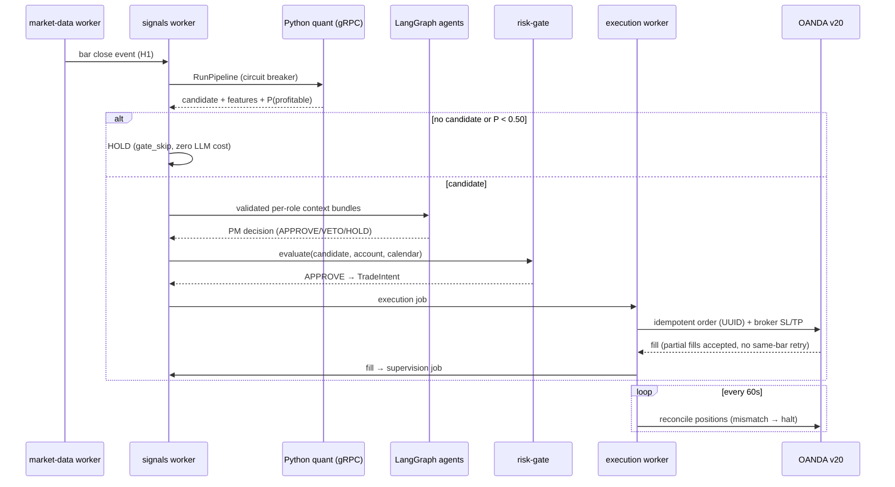
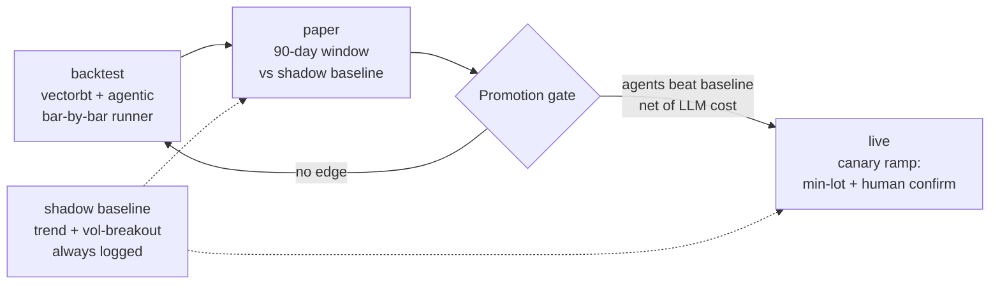

# FX Swing-Trading Platform — Technical Explainer

**AI-powered FX swing trading (H1 → D1) · Deterministic quant core · Multi-agent LLM confirmation · Non-LLM risk gate with final authority**

> Inspired by [TradingAgents (Tauric Research)](https://github.com/TauricResearch/TradingAgents), re-engineered around a measurable quant backbone with real execution, real costs, and hard risk control. Invite-only, own-broker-account-only, personal/research use. Not financial advice.

---

## 1. The one-paragraph pitch

A single-operator platform that trades FX majors, XAU/USD, and oil on H1/D1 timeframes. A **deterministic Python quant core** generates candidate signals with a calibrated probability of profitability. A **LangGraph.js multi-agent LLM layer** (analysts → bull/bear debate → trader → risk team → PM) confirms, vetoes, or explains — but never sizes a trade. A **non-LLM risk gate** holds final authority over everything: caps, drawdown halts, correlation limits, kill-switch. Every decision is fully auditable and replayable.

## 2. Core design principles

| # | Principle | Meaning |
|---|---|---|
| 1 | **Quant first, LLM second** | Quant generates + sizes candidates; LLM only confirms/vetoes/explains |
| 2 | **Single code path** | One `TRADING_MODE` flag (`backtest` \| `paper` \| `live`) — identical logic in every mode |
| 3 | **Deterministic risk gate = final authority** | Kill-switch, DD halts, caps are never delegated to an LLM |
| 4 | **Every decision auditable** | Full provenance; any past decision replays deterministically from stored data |
| 5 | **Point-in-time discipline** | `published_at <= bar_ts` enforced everywhere; look-ahead is a build-breaking defect |
| 6 | **Shadow baseline always on** | Agents must beat a simple quant baseline *net of LLM cost* over 90 days paper before live |
| 7 | **Modular monolith (Node) + microservice (Python)** | Fastify does CRUD/auth/WS/jobs; Python does all maths — "Node never does maths" |
| 8 | **Invite-only, own-account-only** | No pooled money, no fees — preserves FCA scope guardrails |

## 3. System architecture

Five independently deployable planes:



**Why these boundaries:** workers are separate from the API so trading loops never block HTTP handlers; Python owns quant because vectorbt/LightGBM/hmmlearn live there; `risk-gate` is a shared package unit-tested independently of any LLM code.

## 4. Tech stack

| Layer | Technology |
|---|---|
| Frontend | Next.js 16, React 19, Tailwind v4, TradingView Lightweight Charts |
| API | Fastify 5, Auth.js v5 (Google OAuth + credentials, invite-only, TOTP step-up), Zod 4 contracts |
| Async | BullMQ on Redis 8 (AOF `everysec`) |
| Agents | LangGraph.js, multi-provider LLM factory with automatic failover |
| Quant | Python 3.13, FastAPI + gRPC, vectorbt, LightGBM, hmmlearn, FinBERT |
| Database | Self-hosted PostgreSQL 18 + TimescaleDB (community) + pgvector, dedicated volume |
| Broker | OANDA v20 (sole production venue, ADR-005); MT5 adapter optional |
| Infra | Turborepo + pnpm monorepo, Docker Swarm (single-node Hetzner), Caddy auto-TLS, GitHub Actions → GHCR |
| Observability | Grafana · Loki · Tempo, Pino structured logs, Telegram + Twilio SMS alerts |

## 5. The entry decision pipeline

The heart of the system. Agents are **only** invoked when the quant core produces a candidate — no candidate means zero LLM cost (`gate_skip`, ADR-010).



Every stage has a hard timeout budget (full graph 120s, end-to-end 180s); any overrun defaults to **HOLD** — never a hanging job. A gRPC circuit breaker between Node and Python opens after 3 failures in 5 minutes (all calls default HOLD for 60s).

## 6. The multi-agent layer

Modeled on TradingAgents, but with **formal per-role context contracts** (Zod schemas in `@fx/types`) instead of ad-hoc prompts. Specialists run in parallel on disjoint inputs; max 3 concurrent graphs.



Key hardening choices:

- **Debate depth scales with uncertainty:** confirmed trend → 0 rounds; transitional → 1; high HMM entropy → 2.
- **Split-vote tiebreaker:** bull/bear confidence within 0.1 → trader follows quant direction (`QUANT_DEFAULT`), never unstructured LLM discretion.
- **PM digest is code, not an LLM** (ADR-011) — zero cost, reproducible, no new injection surface.
- **Agent memory** is outcome-linked: reflections are updated with the realized R-multiple on trade close, so retrieval surfaces what *worked*, not just what was argued. Hard temporal filter — no future memories ever retrieved.
- **Prompt-injection hardening:** news text is untrusted data; CI runs an adversarial red-team suite including memory-persistence attacks.

## 7. Safety: the deterministic layer

Hard rules enforced in code, never delegated to an LLM:

| Rule | Default |
|---|---|
| Max risk per trade | 1% equity hard ceiling |
| Leverage caps (FCA) | 30:1 FX · 20:1 XAU · 10:1 oil |
| Max concurrent trades / per correlation cluster | 5 / 2 |
| Daily / weekly drawdown halt | 5% / 10% |
| Min entry probability | P ≥ 0.60 **and** PM confirm |
| Min R:R net of costs | 1 : 1.8 |
| Economic-event blackout | ±30 min high-impact |
| Flash-crash spread halt | spread > 5× median → no new entries |
| LLM error behaviour | Default HOLD, always |

### Kill-switch

State lives in **Postgres** (ADR-012) — Redis is only a fast-path cache, so a Redis restart can never silently clear it. Close-out reports `CLOSING` until the broker confirms flat.



### Dead-man's switch (ADR-013)

An **off-host watchdog** on separate infrastructure with its own scoped OANDA token flattens positions directly at the broker if the main host stops heart-beating — an on-host watchdog would die with the host it watches.

## 8. Trade lifecycle (sequence)



Open trades are managed by the **supervisor worker**: a deterministic escalation gate decides *whether* to invoke the LLM supervisor at all; the supervisor emits strict JSON and **can never widen a stop-loss**. Layered exits — first to fire wins.

## 9. Data model (highlights)

TimescaleDB hypertables for time-series: `candles`, `ticks`, `spreads_hist`, `news_archive` (point-in-time indexed), `macro_features`, `features`. Decision audit: `signals`, `agent_runs` (model, prompt hash, cost per call), `agent_debates`, `agent_memory` (pgvector, outcome-linked), `trade_intents`, `trades`, `supervisions`, `baseline_signals`, append-only `audit_log`. Every `agent_runs` row stores `retrieved_memory_ids`, so replay reconstructs the exact context an agent saw.

## 10. Path to live: modes and promotion

One identical code path — only data routing and execution venue change per mode.



Extra guards: if >10% of paper-window bars ran on downgraded LLM models (cost-cap or provider failover), the window auto-extends — a provider incident can't silently invalidate promotion evidence. Champion/challenger retraining shadows the incumbent model before any promotion.

## 11. Monorepo layout

```
fx-platform/
├── apps/dashboard        # Next.js 16 operator UI
├── apis/node-api         # Fastify modular monolith (auth, market, trades, audit, WS)
├── workers/              # BullMQ consumers: market-data, signals, supervisor, execution, watchdog
├── services/quant        # Python 3.13 FastAPI + gRPC: features, models, backtest, brokers
├── packages/
│   ├── types             # Zod contracts — source of truth; JSON Schema → Pydantic
│   ├── risk-gate         # non-LLM final authority (independently unit-tested)
│   ├── llm               # provider factory + failover
│   ├── api-client / auth-client / ui / tsconfig
└── infra/                # compose, deploy, observability, backup
```

## 12. How it differs from TradingAgents

| TradingAgents | This platform |
|---|---|
| LLM agents drive the decision | Deterministic quant core drives; agents only confirm/veto |
| Ad-hoc inter-agent prompts | Formal per-role `AgentContextContract` schemas, fixture-tested |
| Agent memory as chat history | pgvector memory with hard `bar_ts` temporal filter + realized-outcome linkage |
| Research / simulation focus | Real execution: OANDA v20, partial fills, reconciliation, spreads, swap costs |
| No hard risk layer | Non-LLM risk gate + kill-switch + off-host dead-man watchdog with final authority |
| LLM cost unconstrained | Deterministic entry gate (zero-cost skips), cost caps with capability-tier downgrade |

## 13. Build status

Six phases: Foundation → Execution & Quant → Intelligence (agents + risk gate) → Lifecycle (supervision + backtests) → Surface (API + dashboard) → **Go-live** (90-day paper gate). All six phases are code-complete with the full unit-test gate passing (401 Vitest incl. chaos suite; 291 pytest + mypy strict); remaining work is staging drills, champion retrain, and the 90-day paper window before live promotion.

---

*Deep-dive references: [`development-plan/system-design/FX_System_Design.md`](development-plan/system-design/FX_System_Design.md) (full v2.2 design + ADR log), [`development-plan/FX_PRD.md`](development-plan/FX_PRD.md) (requirements + phase plan), story files per workstream (`FE-`/`BE-`/`QN-`).*

*CFDs are high-risk leveraged products. This document describes an engineering system, not financial advice.*
