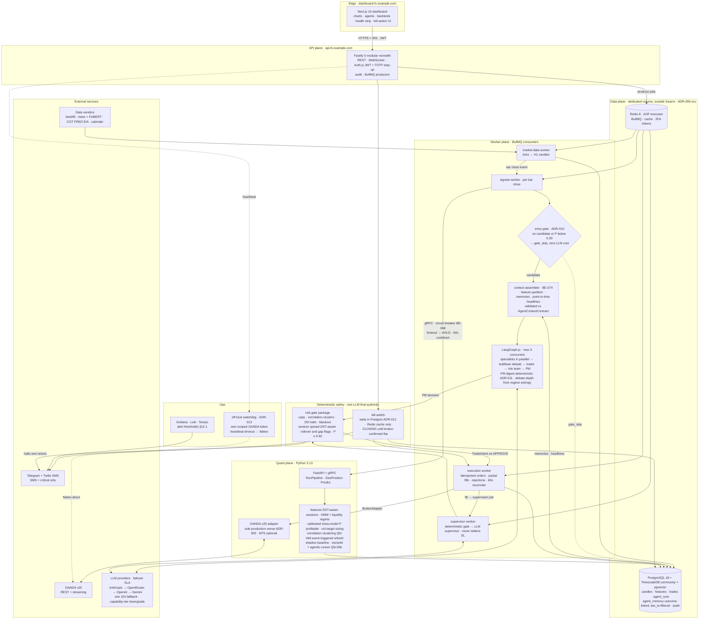

# FX Swing Trading Platform — System Design

*Deterministic quant core · Multi-agent LLM confirmation layer · Deterministic risk gate*

**Version 2.2 · 1 July 2026**  
**Operating regime:** H1 → D1 swing trading · FX majors, XAU/USD, WTI/Brent  
**Scope:** Single-user / invite-only · own broker account only

*Architecture inspired by Tauric Research's TradingAgents, re-engineered around a measurable quant backbone with real execution, costs and risk control.*

> **Version-pin source of truth:** every package, runtime and tool referenced in this document is pinned in the user-story files:
> – Frontend: [`FX_Stories_Frontend.md`](../FX_Stories_Frontend.md) § *Pinned package versions*
> – Node / infra: [`FX_Stories_NodeAPI.md`](../FX_Stories_NodeAPI.md) § *Pinned package versions*
> – Python quant: [`FX_Stories_PythonQuant.md`](../FX_Stories_PythonQuant.md) § *Pinned package versions*
>
> If this document and the story files disagree on a version, **the story files win**. This document is updated when the *shape* of the architecture changes, not every dependency bump.

**Architecture diagram:** [`FX_Architecture_Diagram.mermaid`](FX_Architecture_Diagram.mermaid) (rendered inline in §2)

---

## 0. How to read this document

This document is the concrete system design for an AI-powered FX swing-trading platform. It maps the development baseline into specific repositories, services, schemas, deployment targets, and execution steps.

**Companion documents:**

| Document | Contents |
|---|---|
| [`FX_System_Design.md`](FX_System_Design.md) | This file — overview, topology, auth, data model, compliance, roadmap |
| [`FX_Architecture_Diagram.mermaid`](FX_Architecture_Diagram.mermaid) | Visual architecture (Mermaid; rendered inline in §2) |
| [`FX_Stories_Frontend.md`](../FX_Stories_Frontend.md) | Tracker-ready frontend stories (`FE-` prefix) |
| [`FX_Stories_NodeAPI.md`](../FX_Stories_NodeAPI.md) | Fastify API, workers, BullMQ, infra stories (`BE-` prefix) |
| [`FX_Stories_PythonQuant.md`](../FX_Stories_PythonQuant.md) | Python quant service stories (`QN-` prefix) |

Decisions confirmed for v2.0:

- **Frontend:** Turborepo monorepo with one Next.js 16 dashboard app (`apps/dashboard`).
- **Backend:** Node.js (Fastify 5) modular monolith for the user-facing API; BullMQ workers for async trading loops; LangGraph.js for multi-agent orchestration.
- **Quant:** Python 3.13 (FastAPI + gRPC) for all numerical/statistical work and broker adapters (**OANDA v20 primary**; MT5 retained as optional adapter only).
- **Database:** **Self-hosted PostgreSQL 18 + TimescaleDB (community edition) + pgvector** on a dedicated Hetzner volume with its own container lifecycle — **not** co-located in the application Swarm stack (ADR-006 rev. v2.2). Neon rejected: it ships only Apache-2 TimescaleDB, which lacks continuous aggregates, compression, and retention policies (all required by BE-020).
- **Auth:** Google OAuth + email/password via Auth.js v5 (NextAuth); invite-only registration; TOTP 2FA step-up for sensitive trading operations.
- **Scope:** Invite-only, own-account-only, no monetisation — UK personal/research framing.

---

## 1. Design principles

These are non-negotiable; every later decision derives from them.

1. **Quant backbone first, LLM second.** The deterministic Python quant core generates and vol-sizes candidate signals plus a calibrated meta-model probability. The LLM confirms, vetoes, or explains — it never sizes a trade or sets risk.
2. **Single code path across modes.** One `TRADING_MODE` flag (`backtest` | `paper` | `live`) wires through all services. The identical quant + agent code path runs in every mode; only data routing and execution venue change.
3. **Deterministic risk gate holds final authority.** A non-LLM `risk-gate` package can override quant candidates, agent approvals, and supervisor suggestions. Kill-switch, drawdown halts, and correlation caps are never delegated to an LLM.
4. **Every decision is auditable.** Full provenance: `agent_runs`, `debates`, `supervisions`, `features`, candle snapshots. A past decision must replay deterministically from stored data.
5. **Point-in-time discipline.** News, macro features, and agent memory are timestamped. Backtests enforce `published_at <= bar_ts`. Look-ahead is a build-breaking defect. Agent memory is first-class (not optional): vector store with `bar_ts` temporal filter per §9.5.
6. **Shadow baseline always on.** A simple quant baseline (trend + vol-breakout) runs alongside the agent stack. Agents must beat baseline **net of LLM cost** over a 90-day paper run before live trading is permitted.
7. **Modular monolith on Node, microservice on Python.** Fastify handles CRUD, auth, WebSocket fanout, and job production. Python owns maths, indicators, backtesting, and broker-native adapters. The boundary is process-level.
8. **Invite-only, own-account-only.** Closed registration preserves FCA scope guardrails. Each user connects their own broker; the platform never holds or pools client money.

---

## 2. System topology at a glance

The system has five logical planes. Each is independently deployable. The diagram below is the **final v2.2 architecture** (source of truth: [`FX_Architecture_Diagram.mermaid`](FX_Architecture_Diagram.mermaid)):



The five planes:

1. **Edge / frontend plane** — Next.js 16 dashboard (App Router, React 19, Tailwind v4, TradingView Lightweight Charts).
2. **API plane (Node)** — Fastify 5 modular monolith. BFF for the dashboard; auth, CRUD, WebSocket gateway, BullMQ producers, audit log.
3. **Worker plane (Node)** — Four BullMQ consumer processes: market-data, signals (entry cycle + LangGraph), supervisor, execution & reconciliation.
4. **Quant plane (Python)** — FastAPI REST + gRPC service for features, regime, sizing, meta-model, validation, shadow baseline, broker adapters.
5. **Data plane** — Self-hosted PostgreSQL 18 + TimescaleDB (community) + pgvector on a dedicated volume, separate from the app Swarm stack; Redis 8 (BullMQ + cache + step-up 2FA tokens; **AOF `everysec` persistence** — BullMQ durability and cache correctness depend on it).

The Mermaid diagram above is the full visual; the standalone source lives at [`FX_Architecture_Diagram.mermaid`](FX_Architecture_Diagram.mermaid).

### 2.1 Decision flow (entry)

```
Bar close (H1/D1)
    → Python quant: features + regime + session + liquidity + vol-size + calibrated P(profitable)
        [gRPC circuit breaker: timeout → HOLD, no unhandled throw]
    → deterministic entry gate (ADR-010): agents invoked ONLY if quant emits a
      candidate with P ≥ 0.50 pre-filter; else HOLD (`gate_skip`, zero LLM cost)
    → LangGraph.js: domain specialists (parallel) → bull/bear debate → trader → risk team → PM
        [debate depth linked to regime uncertainty; concurrency cap max 3 graphs]
        [per-stage timeout budget; overrun → HOLD + audit]
    → risk-gate (non-LLM): caps, correlation, DD, blackout, spread + session filter
    → TradeIntent → BrokerAdapter (OANDA v20)
    → execution worker: idempotent order + partial-fill handling + broker SL/TP + persist fills
```

Supervision (open trades): deterministic escalation gate → LLM supervisor (strict JSON, never widen SL) → layered exits (first-to-fire wins).

### 2.2 Pipeline latency budgets

Explicit timeout SLAs per stage. On any budget overrun the affected stage defaults to **HOLD** (a single missing specialist degrades to NEUTRAL), logs a reason code, and does **not** leave BullMQ jobs hanging. The **end-to-end clock starts at LangGraph semaphore acquisition**, not job enqueue, so instruments queued behind the concurrency cap are never starved into systematic HOLDs.

| Stage | H1/D1 budget | M15/M30 budget (future) | On timeout |
|---|---|---|---|
| gRPC `RunPipeline` | 30s | 10s | HOLD; circuit failure counted |
| Specialist analysts (3, **run in parallel** — disjoint inputs) | 20s | 10s | Missing specialist = NEUTRAL stance |
| Each debate round (bull + bear) | 30s | 15s | Round skipped; noted in transcript |
| Trader / risk team / PM (each) | 15s | 10s | Stage output = HOLD |
| LangGraph full graph | 120s | 45s | HOLD; partial transcript persisted |
| Risk-gate evaluation | 2s | 2s | VETO (fail-safe) |
| **End-to-end (semaphore acquisition → TradeIntent)** | **180s** | **60s** | HOLD; job marked complete (no silent retry loop) |

**Budget arithmetic (worst case, 2 debate rounds):** 20 + 30 + 30 + 15 + 15 + 15 = 125s ≈ 120s graph budget — stages now sum to their parent. **Provider failover is capped at one fallback attempt with a 10s timeout** (not a fresh full budget), so a degraded provider cannot double a stage's worst case. Note the graph is slowest exactly in high-uncertainty regimes (auto 2 rounds) — BE-120 includes a chaos scenario asserting E2E <180s with 2 rounds + one degraded provider.

gRPC circuit breaker (Node → Python): 3 failures in 5 min → **open for 60s** (all calls default HOLD without attempting connection) → half-open probe → close on success. Identical parameters in BE-068.

---

## 3. Repository layout (Turborepo monorepo)

```
fx-platform/
├── apps/
│   └── dashboard/                  # Next.js 16 — operator UI
│       ├── app/
│       │   ├── (auth)/             # sign-in, register, verify, reset
│       │   ├── (dashboard)/        # equity, positions, kill-switch
│       │   ├── charts/
│       │   ├── agents/
│       │   ├── trades/
│       │   ├── backtest/
│       │   ├── quant/
│       │   ├── calendar/
│       │   ├── audit/
│       │   └── settings/
│       ├── auth.ts                 # Auth.js v5 config
│       └── package.json
│
├── apis/
│   └── node-api/                   # Fastify modular monolith
│       ├── src/
│       │   ├── modules/            # auth, market, signals, trades, settings, audit
│       │   ├── plugins/            # auth, db, ws, logging
│       │   └── server.ts
│       ├── prisma/
│       └── package.json
│
├── workers/
│   ├── market-data/
│   ├── signals/                    # entry cycle + LangGraph orchestrator
│   ├── supervisor/
│   └── execution/
│
├── services/
│   └── quant/                      # Python FastAPI + gRPC
│       ├── app/
│       │   ├── grpc/               # pipeline, sizing, predict
│       │   ├── brokers/            # MT5, OANDA adapters
│       │   ├── features/
│       │   ├── models/
│       │   └── backtest/
│       ├── pyproject.toml
│       └── Dockerfile
│
├── packages/
│   ├── ui/                         # shadcn design system
│   ├── types/                      # Zod schemas + TS types (incl. AgentContextContract)
│   ├── api-client/
│   ├── auth-client/                # NextAuth wrappers, useCan, step-up 2FA
│   ├── risk-gate/                  # non-LLM final authority
│   ├── agents/                     # LangGraph.js graph definitions + context contracts
│   ├── agent-memory/               # vector store retrieval with bar_ts filter
│   ├── tsconfig/
│   └── eslint-config/
│
├── infra/
│   ├── docker-compose.local.yml
│   └── github-actions/
│
├── turbo.json
├── pnpm-workspace.yaml
└── README.md
```

### 3.1 Why these boundaries

- **Workers separate from API:** Market-data and execution loops must not block HTTP handlers. BullMQ gives durable, retryable job semantics with visibility.
- **Python for quant + brokers:** MT5 is Python-native; vectorbt/LightGBM/hmmlearn ecosystems live in Python. Node never does maths.
- **Shared `risk-gate` package:** Imported by signal worker and execution worker. Single source of truth for caps — unit-tested independently of LLM code.

---

## 4. Authentication & access control

### 4.1 Identity methods

Two sign-in methods, one user account per human:

| Method | Implementation |
|---|---|
| **Google OAuth** | Auth.js v5 (`next-auth@5`) Google provider; JWT session strategy |
| **Email + password** | Auth.js Credentials provider; Fastify `POST /auth/register` + `POST /auth/login`; argon2 password hashes in Postgres |

### 4.2 Invite-only registration

Public registration requires a valid **invite code**. This preserves the invite-only, no-public-marketing scope (FCA financial-promotion guardrails).

| Path | Invite required? |
|---|---|
| Email/password register | Yes — invite code validated server-side |
| Google first sign-in | Yes — unless email was pre-provisioned with a valid invite |
| Returning user sign-in | No |

Invite codes are created by the platform operator (single-user MVP: self-administered). Stored in `invite_codes` with expiry, max uses, and audit trail.

### 4.3 Identity model

```
users
  ├── id (uuid)
  ├── email (unique, verified)
  ├── google_sub (nullable — set on Google link)
  ├── password_hash (nullable — set on credentials register)
  ├── name, avatar_url
  ├── email_verified_at
  ├── totp_secret (nullable — encrypted at rest)
  ├── status: active | suspended
  └── role: operator (MVP single-user; schema ready for multi-user later)
```

**Account linking:** If Google sign-in email matches an existing verified credentials account, `google_sub` is linked to the same row. User can then sign in with either method.

### 4.4 Session and authorization flow

1. User authenticates via NextAuth (Google OAuth or Credentials).
2. NextAuth `signIn` callback calls Fastify `POST /auth/sign-in-sync` (server-to-server, `INTERNAL_SYNC_TOKEN`).
3. Fastify upserts `users`, validates invite status, returns `{ userId, email, role, emailVerified }`.
4. NextAuth `jwt` callback embeds claims: `{ userId, email, role, stepUp2FAAt }`.
5. Dashboard API calls include `Authorization: Bearer <nextauth_jwt>`.
6. Fastify `auth` plugin verifies JWT with shared `NEXTAUTH_SECRET` via `jose`.

```ts
type RequestContext = {
  user: { id: string; email: string; googleSub?: string };
  role: 'operator';
  stepUp2FAAt?: number;   // unix ts of last TOTP verification
  requestId: string;
};
```

### 4.5 TOTP 2FA step-up (sensitive operations only)

Required for:

- Kill-switch activation
- `TRADING_MODE` toggle to `live`
- Broker credential writes
- Live-promotion gate confirmation

Not required for: dashboard reads, chart viewing, backtest runs, paper trading.

Flow: user completes TOTP challenge → Fastify sets `stepUp2FAAt` in session (valid 15 minutes) → `requireStepUp2FA` middleware checks freshness on protected routes.

**Recovery:** enrollment issues **10 single-use recovery codes** (argon2-hashed at rest, shown once). A documented break-glass procedure covers TOTP device loss — without this, losing a phone locks the operator out of the kill-switch (BE-036, FE-035).

### 4.6 Broker credentials

Stored encrypted (libsodium-sealed, KMS/env master key). Never returned in full to the frontend after initial save. Per-user isolated MT5 terminal/container recommended.

---

## 5. Node API — Fastify modular monolith

### 5.1 Module list

| Module | Responsibility |
|---|---|
| `auth` | sign-in-sync, register, login, verify email, reset password, invite codes, TOTP |
| `market` | candles, ticks, instruments, data-quality status |
| `signals` | candidate list, agent runs, debates (read) |
| `trades` | positions, history, fills, reconciliation status |
| `backtests` | config, run trigger, results |
| `settings` | mode, broker, risk params, LLM model picks, agent weights |
| `audit` | append-only audit log queries |
| `realtime` | WebSocket gateway (`@fastify/websocket`) |
| `notifications` | Telegram webhook config, email prefs |

### 5.2 Request lifecycle

1. `@fastify/helmet`, CORS, rate-limit
2. Request ID assignment (Pino child logger)
3. JWT auth plugin → `RequestContext`
4. Zod validation (`fastify-type-provider-zod`)
5. Handler → service → Prisma
6. Audit log write on state-changing actions
7. OpenTelemetry span close

### 5.3 WebSocket events

Channels: `user:{userId}:events`

Event types: `signal.candidate`, `agent.debate`, `supervisor.decision`, `trade.fill`, `pnl.update`, `risk.halt`, `reconciliation.mismatch`, `kill_switch.activated`

### 5.4 BullMQ job producers

| Queue | Producer | Consumer worker |
|---|---|---|
| `market-data` | API (on instrument subscribe) | `workers/market-data` |
| `signals` | market-data worker (on bar close) | `workers/signals` |
| `supervision` | execution worker (on fill) | `workers/supervisor` |
| `execution` | signals worker (on TradeIntent) | `workers/execution` |
| `reconciliation` | cron repeatable (60s) | `workers/execution` |
| `notifications` | any module | `workers/notifications` |

### 5.5 Talking to Python quant service

- **gRPC** (primary): `Pipeline`, `SizePosition`, `Predict` — low-latency, called from signal worker on bar close.
- **HTTP REST** (secondary): backtest triggers, admin quant status — called from API module.
- Context forwarded as signed `X-FX-Context` JWT (userId, requestId, tradingMode).

---

## 6. Python quant service

### 6.1 gRPC surface

| RPC | Input | Output |
|---|---|---|
| `RunPipeline` | instrument, timeframe, bar_ts, mode | features, regime, candidate direction/zones |
| `SizePosition` | candidate, account, instrument | vol-targeted lots, calibrated probability |
| `Predict` | feature vector | P(profitable), calibrated |
| `ValidateModel` | model_id, oos_config | validation verdict, metrics |

### 6.2 REST surface (dashboard / backtest)

| Endpoint | Purpose |
|---|---|
| `GET /healthz` | Health check |
| `POST /backtest/run` | vectorbt engine trigger |
| `GET /models/{id}/calibration` | Calibration curve data |
| `GET /regime/{instrument}` | Regime timeline |

### 6.3 Broker adapters (Python-native)

Typed `BrokerAdapter` interface (Zod contract shared via JSON Schema → Pydantic):

- **OANDA v20** (primary): REST + streaming, idempotent `clientExtensions` — sole production execution venue
- **MT5** (optional): MetaTrader5 Python package; retained for future use, not on critical path

Symbol mapping table per broker: `EUR_USD`, `XAU_USD`, `WTICO_USD`, `BCO_USD` (OANDA naming).

---

## 7. Data model (core entities)

### 7.1 Time-series (TimescaleDB hypertables)

| Table | Purpose |
|---|---|
| `candles` | OHLCV per instrument × timeframe |
| `ticks` | Raw tick stream (retention policy) |
| `spreads_hist` | Spread snapshots for filter/backtest |
| `news_archive` | Point-in-time headlines (`published_at` indexed) |
| `macro_features` | COT, EIA, FRED — release-time aware |
| `features` | Computed feature vectors per bar (incl. `session_label`, `liquidity_regime`) |

Continuous aggregates: M5 → H4 → D1.

### 7.2 Trading & decision audit

| Table | Purpose |
|---|---|
| `signals` | Quant candidates + meta-model probability |
| `agent_runs` | Per-agent LLM call (model, prompt_hash, cost) |
| `agent_debates` | Bull/bear transcripts |
| `agent_memory` | Vector-embedded reflections; `bar_ts` indexed; retrieval bounded by temporal filter |
| `trade_intents` | Post-risk-gate execution plans |
| `trades` | Open/closed positions, broker IDs, swap_pnl |
| `supervisions` | LLM supervisor decisions per open trade |
| `baseline_signals` | Shadow quant baseline (always logged) |
| `audit_log` | Append-only state changes |
| `backtest_runs` | Config, metrics, validation verdict |

### 7.3 Auth & compliance

| Table | Purpose |
|---|---|
| `users` | Identity (Google + credentials) |
| `invite_codes` | Invite-only registration |
| `email_verification_tokens` | Email verify + password reset |
| `broker_credentials` | Encrypted per-user broker auth |

---

## 8. Brokers & execution venues

All execution goes through one typed **BrokerAdapter** interface. Venues are swappable; risk/execution logic is broker-agnostic.

**Production decision (ADR-005):** **OANDA v20 is the sole execution venue** for swing trading. Full REST + streaming API, JSON in/out, no terminal dependency, works natively from Fastify/Python with `httpx`. No Windows VM, no Wine, no MQL5 bridge. MT5 adapter remains in codebase for optional future use but is **not** on the critical path.

| Broker / platform | API surface | Instruments | Fit & notes |
|---|---|---|---|
| **OANDA v20** | REST + streaming | FX majors, metals; oil varies | **Primary.** FCA-regulated; idempotent `clientExtensions`; native from Node/Python. |
| **MetaTrader 5 brokers** | MetaTrader5 Python pkg | FX majors, XAU, WTI/Brent | Optional adapter only. Headless terminal adds ops burden. |
| **Interactive Brokers** | TWS / Client Portal | Multi-asset | Later expansion path. |
| **IG** | REST + streaming | FX, indices, commodities CFDs | FCA. Native API strong. |
| **Saxo Bank** | OpenAPI | FX, metals, energy | Institutional execution. |
| **cTrader brokers** | Open API + FIX | FX, metals, energy CFDs | Raw ECN, low latency. |
| **Dukascopy** | JForex / FIX | FX, metals, CFDs | Tick data quality. |

**Partial fills:** When `fill_qty < requested_qty`, execution worker accepts partial, logs remainder, and **does not** auto-retry remainder in the same bar cycle (avoids doubling exposure). Operator notified; remainder requires next signal cycle or manual action.

**UK retail leverage caps (enforced in code):** 30:1 FX majors, 20:1 XAU & non-major FX, 10:1 commodities (oil).

---

## 9. Data vendors

Layered multi-vendor stack; no single feed is a point of failure. Every external input carries a reliable **point-in-time timestamp**.

### 9.1 Price / market data

| Vendor | Use |
|---|---|
| Broker feed (OANDA) | Primary live + execution-aligned prices + **primary historical backfill** (candles API, incl. XAU_USD) |
| Broker feed (MT5) | Optional alternate feed |
| Twelve Data (free tier) | Discrepancy cross-check for backfilled candles |
| Alpha Vantage | Cross-check + economic indicators |
| Polygon.io (Massive) / Databento / TraderMade / EODHD / Tiingo | Deferred — revisit for multi-year history, tick data, or non-OANDA instruments |

### 9.2 News & sentiment

| Vendor | Use |
|---|---|
| Finnhub | Headlines + calendar + sentiment |
| RavenPack / Bigdata.com | Institutional point-in-time news (paid) |
| Marketaux / Event Registry | Macro/FX headline breadth |
| FinBERT (self-hosted) | Local sentiment scoring |

### 9.3 Macro / flow

| Source | Point-in-time rule |
|---|---|
| CFTC COT | Join on RELEASE time, not reference date |
| U.S. EIA | Store first-print and revisions separately |
| FRED / ALFRED | Vintage series for release lag |
| Trading Economics / FMP | Economic calendar → blackout windows |

### 9.4 LLM providers

Provider factory with per-agent overrides. Temperature 0, strict JSON mode, prompt-hash caching, per-call cost tracking. Pin exact model snapshots.

| Provider | Role |
|---|---|
| Anthropic (default) | PM, Supervisor, premium reasoning |
| OpenAI | Alternate analyst/debate |
| Google Gemini | Cost/coverage diversity |
| OpenRouter | Automatic failover routing when primary degraded |
| Ollama (local) | Offline analyst pre-screen |

**Failover SLA (automatic, not manual):**

| Condition | Wait before failover | Fallback chain |
|---|---|---|
| Provider HTTP 5xx or timeout (per-stage budget, §2.2) | Immediate — **one fallback attempt, 10s timeout** | Anthropic → OpenRouter (same model family) → OpenAI → Gemini |
| Provider latency p95 >15s over 5 min window | After 2 consecutive slow calls | Downgrade one capability tier via OpenRouter |
| Provider rate-limit (429) | Exponential backoff max 10s, then failover | Next provider in chain |
| Monthly cost cap at 90% | Immediate | Auto-downgrade all agents **one capability tier** (provider-agnostic mapping in provider factory — never a hardcoded model name); PM retains premium until 95% |

Capability degradation on auto-downgrade is logged in `agent_runs` with `model_downgraded: true`. Downgraded runs are excluded from live-promotion evidence unless operator explicitly accepts. **Paper-window policy:** if >10% of bars in the 90-day paper run executed downgraded, the window auto-extends until ≥90% of bars are full-capability — a week-long provider incident must not silently invalidate promotion evidence.

### 9.5 Agent memory & context protocol

Inspired by [TradingAgents](https://github.com/tauricresearch/tradingagents) inter-agent context passing, but with explicit contracts rather than ad-hoc prompts.

**Memory store:** `agent_memory` table + pgvector (in the self-hosted Postgres instance). Each reflection embeds `{ instrument, bar_ts, agent_role, summary, embedding, embedding_model, outcome }`.

**Retrieval strategy:** On each agent invocation, retrieve top-K (default K=5) memories where `memory.bar_ts <= current_bar_ts` AND `instrument` matches, ranked by cosine similarity to current feature summary. Hard temporal filter — no future memories ever retrieved.

**Write protocol (two-phase, outcome-linked):**

1. After PM decision, a reflection node summarises the debate outcome and writes to memory.
2. **On trade close (or candidate expiry), the reflection is updated with the realized outcome** — R-multiple, SL/TP hit, holding period. Retrieval must surface what *worked*, not just what was argued; a decision-time-only reflection is confident rationale with no quality signal (this is where TradingAgents' memory earns its value).

**Hygiene:** max 500 memories per instrument with relevance-weighted eviction; near-duplicates (cosine >0.95) merged; memories older than 18 months decay out of top-K ranking. Unbounded top-K over ever-growing self-generated text degrades quietly.

**Versioning & provenance:** `embedding_model` is pinned per row — an embedding model change triggers an explicit re-embed migration, never silent mixing. Every `agent_runs` row stores `retrieved_memory_ids`, so QN-062 replay can reconstruct the exact context an agent saw.

### 9.6 Agent context contracts (per role)

Formal input/output schema per agent role — defined in `@fx/types` as `AgentContextContract`. Prompt engineering is versioned and testable against fixtures.

| Agent | Inputs | Output schema | Tools |
|---|---|---|---|
| **Technical analyst** | Regime label, indicator features, S/R levels, session label | `{ stance: BULL\|BEAR\|NEUTRAL, confidence: 0-1, rationale }` | None |
| **Macro analyst** | COT, FRED, EIA features (release-time filtered) | `{ stance, confidence, rationale }` | None |
| **Sentiment analyst** | FinBERT scores, news headlines (untrusted data block) | `{ stance, confidence, rationale }` | None |
| **Bull researcher** | All specialist outputs + candidate signal | `{ argument, confidence }` | None |
| **Bear researcher** | All specialist outputs + candidate signal | `{ argument, confidence }` | None |
| **Trader** | Specialist outputs + debate transcript (full, not summary) | `{ action: ENTER\|HOLD\|EXIT, direction, confidence }` | None |
| **Risk team** | Trader output + raw quant P(profitable) + account state | `{ approve: bool, concerns[] }` | None |
| **PM** | Risk team output + trader output + debate **summary** (not full transcript) | `{ decision: APPROVE\|VETO\|HOLD, rationale }` | None |

**Context assembly (BE-074):** the signal worker's **context-assembler** owns building each role's bundle — it partitions quant features per the table above, fetches point-in-time-filtered headlines for the sentiment analyst (gRPC `RunPipeline` returns features only; headlines come from `news_archive`), retrieves memories per §9.5, and validates every bundle against `AgentContextContract` **before** invocation. The three specialists run **in parallel** — their inputs are disjoint by contract.

**PM debate summary — deterministic digest (ADR-011):** code, not an LLM, assembles the PM's summary from schema-validated agent JSON: specialist stances + confidences, final-round bull/bear arguments, trader action, risk-team concerns, tiebreaker flag. Zero cost, zero added latency, no new injection surface, fully reproducible. (An LLM summarizer node was considered and rejected — it would itself be injectable and would need its own red-team scope.)

**Debate depth linked to regime:** Configurable 0/1/2 rounds, but default mapping from regime detector:

| Regime uncertainty | Debate rounds | Rationale |
|---|---|---|
| Confirmed trend (low HMM entropy) | 0 | Stable markets; speed over deliberation |
| Transitional / mixed | 1 | Default |
| High uncertainty (entropy > threshold) | 2 | Deeper deliberation when signal quality matters most |

**Consensus tiebreaker:** When bull and bear confidence differ by <0.1 (split vote), trader agent receives explicit `tiebreaker_mode: QUANT_DEFAULT` instruction: follow quant candidate direction if P ≥ threshold, else HOLD. Never left to unstructured LLM discretion.

**Concurrency cap:** Max 3 simultaneous LangGraph graph runs (semaphore on signal worker). Additional bar-close jobs queue with priority by instrument liquidity.

---

## 10. Risk management & non-negotiables

Hard rules enforced in code; never delegated to an LLM.

| Rule | Default | Configurable |
|---|---|---|
| Position sizing | Vol-targeted (1×ATR ≈ fixed % equity) | Yes |
| Max risk per trade | 1% equity hard ceiling | Per instrument |
| Max leverage (FCA) | 30:1 FX, 20:1 XAU, 10:1 oil | Tighter only |
| Max concurrent trades | 5 | Yes |
| Max correlated exposure | 2 per cluster | Auto + override |
| Correlation clustering | Hierarchical (Pearson), 60-day lookback, 0.7 threshold; weekly refresh | Yes |
| Daily / weekly DD halt | 5% / 10% | Yes |
| Per-instrument daily loss | 2% equity per instrument (early-warning tripwire — the 5% daily halt still binds first) | Yes |
| Min R:R (net of costs) | 1 : 1.8 | Yes |
| Max spread filter | 3 pips FX, 50¢ XAU, 5¢ oil; session-adjusted multipliers | Per instrument |
| Session spread multiplier | 1.5× overnight (Tokyo/Sydney), 1.0× London/NY overlap; **session boundaries DST-aware (IANA tz, exchange-local time — never fixed UTC hours)** | Yes |
| Economic-event blackout | ±30 min high-impact | Per currency |
| Min entry probability | P ≥ **0.60** AND PM confirm | Yes (default 0.60; rationale: 0.55 too close to random for calibrated model) |
| Wednesday rollover (triple swap) | Flag positions held >2 days crossing rollover at **17:00 New York time (DST-aware — 21:00/22:00 UTC)**; risk gate warns; optional auto-flatten for XAU | Yes |
| Weekend gap exposure | Optional pre-Friday-close flatten in high-vol regime; **close window anchored to 17:00 NY Friday (DST-aware)**; configurable per instrument | Yes |
| Flash crash / extreme spread | Spread >5× median → halt new entries + alert; existing positions: kill-switch only | Always on |
| Kill-switch | Cancel + close < 2s; pause workers | Always on |
| Reconciliation | Every 60s; mismatch → halt | Always on |
| LLM error behaviour | Default HOLD | Always on |
| No look-ahead | `published_at <= bar_ts` | Always on |

---

## 11. Compliance & scope (UK, personal / invite-only)

> **Engineering intent, not legal advice.** Confirm with a UK-qualified adviser before onboarding anyone or going live.

- **Own-account only.** Each user connects their own broker; platform never holds client money.
- **No fees, no signals-for-sale.** Monetisation would likely trigger FCA-regulated activity.
- **Invite-only.** Closed registration via invite codes; no public marketing of returns.
- **Educational / research framing.** In-app disclaimer: not financial advice; past performance not indicative.
- **CFD risk + leverage.** FCA caps encoded in risk gate; high-risk warnings surfaced in-app.
- **GDPR.** Encrypted user data; LLM providers with acceptable DPAs; retention policy enforced.

---

## 12. Infrastructure & observability

| Component | Choice |
|---|---|
| Host | Hetzner CCX dedicated vCPU, Ubuntu 24.04 LTS |
| Containers | Docker Compose (dev); Docker Swarm single-node (prod) |
| Database (prod) | **Self-hosted PostgreSQL 18 + TimescaleDB (community) + pgvector** — dedicated Hetzner volume, own container lifecycle, **outside** the app Swarm stack; backup/recovery SLA (RPO <1h, RTO <4h) via Restic + weekly restore drill |
| Database (dev) | PostgreSQL 18 + TimescaleDB in Docker Compose — identical image to prod (full dev/prod parity) |
| Critical alerting | **Telegram + Twilio SMS** — SMS reserved for critical severity (kill-switch, reconciliation mismatch, circuit open, dead-man trigger) |
| Reverse proxy | Caddy 2.x — automatic TLS |
| CI/CD | GitHub Actions → GHCR → SSH deploy |
| Observability | Grafana / Loki / Tempo; Pino structured logs |
| Backups | Restic → S3-compatible; nightly Postgres; weekly restore drill |

### 12.1 Grafana alerting thresholds

| Alert | Condition | Severity | Action |
|---|---|---|---|
| LLM latency high | p95 per-agent call >30s for 5 min | Warning | Telegram; check provider status |
| LLM latency critical | p95 full graph >120s for 3 min | Critical | Telegram + SMS; auto-failover should engage |
| Queue depth spike | `signals` queue depth >10 for 2 min | Warning | Check worker health + concurrency cap |
| Queue depth critical | `signals` queue depth >25 OR job age >300s | Critical | Telegram + SMS; investigate stuck jobs |
| gRPC circuit open | Circuit breaker state = OPEN | Critical | Telegram + SMS; quant service degraded |
| Reconciliation mismatch | Any mismatch event | Critical | Auto-halt + Telegram + SMS |
| Daily DD approaching | Unrealised + realised DD >4% (80% of halt) | Warning | Telegram |
| LLM cost cap | Monthly spend >85% | Warning | Review model downgrade log |
| Database connection failures | >3 connection errors in 1 min | Critical | Telegram + SMS; check DB host + volume |
| Spread anomaly | Live spread >3× session median | Warning | Liquidity regime flag; tighten filters |

---

## 13. Key sequence flows

### 13.1 Entry decision cycle (live/paper)

1. Market-data worker aggregates tick → H1 candle close.
2. Signal worker enqueues on bar close.
3. gRPC `RunPipeline` → quant candidate + features.
4. **Deterministic entry gate:** no candidate, or P < 0.50 pre-filter → HOLD, logged `gate_skip`, zero LLM cost (ADR-010).
5. Context assembler builds per-role bundles (features partition + memories + point-in-time headlines), validates against contracts (BE-074).
6. LangGraph.js: analysts (parallel) → debate → trader → risk team → PM (deterministic digest).
7. `risk-gate.evaluate(candidate, account, calendar)` → APPROVE | MODIFY | VETO.
8. On APPROVE: execution worker places order via BrokerAdapter (idempotent UUID).
9. WebSocket fanout: `signal.candidate`, `agent.debate`, `trade.fill`.
10. Audit log: every step persisted.

### 13.2 Kill-switch

1. Operator taps kill-switch (requires step-up 2FA if session stale).
2. Fastify `POST /settings/kill-switch` → audit log + **Postgres kill-switch state (source of truth, ADR-012)** + Redis fast-path flag. Workers re-hydrate from Postgres on boot and on cache miss — a Redis restart can never silently clear the kill-switch (BE-073).
3. Execution worker: cancel all pending, market-close all open (< 2s target). **Rejected or partially filled closes retry with escalating alerts; state reports `CLOSING` (never `CLOSED`) until broker-confirmed flat; the 60s reconciler is the backstop.**
4. All workers pause; Telegram + SMS + in-app alert fired.

### 13.3 Auth: email registration

1. User submits email + password + invite code on `/register`.
2. Fastify validates invite, hashes password (argon2), creates user (`email_verified_at = null`).
3. Resend sends verification email with signed token.
4. User clicks link → `GET /auth/verify?token=…` → `email_verified_at` set.
5. User signs in via Credentials provider → NextAuth session issued.

---

## 14. Execution plan (phases)

| Phase | Epics | Outcome |
|---|---|---|
| **Phase 1 — Foundation** | E0, E1 | Monorepo + infra + mode flag; live candles in TimescaleDB |
| **Phase 2 — Execution & Quant** | E2, E3 | Orders on MT5/OANDA; quant core + shadow baseline |
| **Phase 3 — Intelligence** | E4, E5 | Agent stack + risk gate; kill-switch < 2s |
| **Phase 4 — Lifecycle** | E6, E7 | Supervision + reproducible backtests |
| **Phase 5 — Surface** | E8, E9, E10 | Fastify REST/WS + auth + dashboard + notifications |
| **Phase 6 — Go-live** | E11 (+ E12 throughout) | 90-day paper beats baseline; signed gate to live |

E12 (compliance, security, invite codes, GDPR) applies continuously from Phase 1.

Story mapping: see companion files [`FX_Stories_Frontend.md`](../FX_Stories_Frontend.md), [`FX_Stories_NodeAPI.md`](../FX_Stories_NodeAPI.md), [`FX_Stories_PythonQuant.md`](../FX_Stories_PythonQuant.md).

---

## 15. Key hardening decisions

Embedded as acceptance criteria in user stories:

- **Dead-man's switch (off-host, ADR-013):** Watchdog runs on separate infrastructure (different provider/region) with its **own scoped OANDA token**; flattens via broker API even if the Hetzner host is fully down. An on-host watchdog dies with the host it watches.
- **Deterministic entry gate (ADR-010):** Agents invoked only when quant emits a candidate (P ≥ 0.50 pre-filter); zero-cost `gate_skip` otherwise — mirrors the BE-080 supervision gate.
- **Agent memory (required):** Vector store with `bar_ts` temporal filter; retrieval protocol per §9.5; **outcome-linked reflection on trade close; hygiene caps; `embedding_model` versioning; `retrieved_memory_ids` provenance**; never touches sizing/risk.
- **Context assembler (BE-074):** Single owner of per-role bundle building + contract validation; PM summary is a deterministic digest (ADR-011).
- **Kill-switch state in Postgres (ADR-012):** Redis is a fast-path cache only; close-out reports `CLOSING` until broker-confirmed flat.
- **TOTP recovery codes:** 10 single-use codes at enrollment + break-glass procedure — device loss must not lock the operator out of the kill-switch.
- **Agent context contracts:** Formal per-role input/output schema in `@fx/types`; testable against fixtures.
- **gRPC circuit breaker:** Timeout → HOLD at Node→Python boundary; no unhandled throws that BullMQ silently retries; 60s open-state cooldown.
- **Pipeline timeout budgets:** Per-stage sub-budgets that sum to the graph budget (§2.2); specialists parallel; failover capped at one 10s fallback; E2E clock starts at semaphore acquisition; chaos-tested under worst case (2 rounds + degraded provider).
- **Adversarial prompt red-team suite:** Diverse injection patterns (not single fixture) **including memory-persistence attacks** (injected headline → reflection → future bars); mandated in CI.
- **Disagreement cohorts:** Track quant vs LLM conflicts to measure veto value.
- **Prompt-injection hardening:** News/social text treated strictly as data.
- **Debate-regime linkage:** Debate depth auto-scales with regime uncertainty.
- **Consensus tiebreaker:** Explicit QUANT_DEFAULT protocol on split bull/bear votes.
- **LangGraph concurrency cap:** Max 3 simultaneous graph runs.
- **LLM provider failover:** Automatic with documented SLA (§9.4).
- **Partial fill handling:** Accept partial; no same-bar remainder retry.
- **Session-aware features (DST-aware):** London/NY/Tokyo labels defined in exchange-local time via IANA tz — never fixed UTC hours, which are wrong for half the year; rollover and Friday-close windows anchored to 17:00 New York.
- **Liquidity regime:** Separate from HMM trend regime; derived from spread percentile + volume.
- **Rollover/swap management:** Wednesday triple-swap flag; XAU carry cost awareness.
- **Weekend gap strategy:** Optional pre-Friday flatten in high-vol regime.
- **Flash crash response:** Extreme spread halt (not just kill-switch).
- **Cross-currency sizing tests:** Pip/lot/margin per instrument × account currency.
- **Correlation clustering in Python (QN-048):** Node risk gate consumes a precomputed cluster table ("Node never does maths"); weekly refresh **plus event-triggered recompute** on liquidity-regime transition or realized-vol spike.
- **Agentic backtest runner (QN-056):** Event-driven bar-by-bar loop for agent+memory backtests — vectorbt is vectorized and cannot simulate sequential memory accumulation; quant-core results reconciled against vectorbt as a correctness check.
- **Order rejection handling:** REJECTED / INSUFFICIENT_MARGIN / MARKET_HALTED reason codes handled explicitly in the execution worker — no retry storms.
- **Champion/challenger:** Model retrains shadow incumbent before promotion.
- **Canary go-live ramp:** Min-lot + human-confirm on first N live trades.

---

## 16. Open questions

_None currently open._

**Resolved (v2.3):**
- ~~Polygon vs Twelve Data for primary backfill vendor~~ → **Neither for v1: OANDA v20 candles API is the primary backfill source** (free with broker account, covers all traded instruments incl. XAU_USD, execution-aligned bid/ask so backtest spreads match live). Scope is small — ~6 months × handful of pairs ≈ 40 requests/pair at M1. **Twelve Data free tier** (800 calls/day) retained only as discrepancy cross-check. Revisit Polygon/Massive (~$49/mo, unlimited REST) if requirements grow to multi-year history, tick data, or non-OANDA instruments.

**Resolved (v2.2):**
- ~~Telegram-only vs SMS for kill-switch confirmations~~ → **Telegram + Twilio SMS** for critical severity (BE-118)
- ~~pgvector in Neon vs dedicated vector store~~ → **pgvector in the self-hosted Postgres instance**; revisit only if memory exceeds ~1M vectors
- ~~Neon vs self-hosted for prod DB~~ → **Self-hosted TimescaleDB community edition** (ADR-006 rev.) — Neon's Apache-2 edition lacks CAGGs/compression/retention

**Resolved (v2.1):**
- ~~Primary MT5 broker selection~~ → **OANDA v20 sole execution venue** (ADR-005)
- ~~Windows VM vs Wine for headless MT5~~ → **Not needed**; OANDA REST eliminates terminal dependency

---

## 17. Architectural decisions log

| ADR | Decision | Rationale |
|---|---|---|
| ADR-001 | BullMQ over Inngest | Trading needs durable low-latency queues with fine-grained retry control |
| ADR-002 | Python 3.13 not 3.14 | vectorbt/LightGBM/hmmlearn compatibility |
| ADR-003 | Dual auth (Google + email/password) | Operator flexibility; invite gate preserves compliance scope |
| ADR-004 | gRPC for quant hot path | Sub-ms overhead vs REST for per-bar signal worker calls |
| ADR-005 | OANDA v20 sole execution venue | REST + streaming; no terminal/VPS; best stack fit for swing H1/D1 |
| ADR-006 (rev. v2.2) | **Self-hosted TimescaleDB (community) on dedicated volume, outside Swarm** | Neon ships only Apache-2 TimescaleDB — no CAGGs, compression, or retention (all required by BE-020). Isolation intent preserved: separate volume, own lifecycle |
| ADR-007 | Agent memory required (not optional) | LLM value is qualitative synthesis; stateless per-bar agents lose edge |
| ADR-008 | P(profitable) threshold 0.60 default | 0.55 too close to random for calibrated model; tunable via backtest curves |
| ADR-009 | gRPC circuit breaker + pipeline timeouts | Prevent BullMQ silent retry loops on quant/agent failures |
| ADR-010 | Deterministic entry gate before agent graph | Agents run only on quant candidates (P ≥ 0.50 pre-filter); prevents ~190 no-op multi-agent runs/day and mirrors the BE-080 supervision gate |
| ADR-011 | PM debate summary = deterministic digest | Zero cost/latency, no new injection surface, fully reproducible; an LLM summarizer would itself need red-teaming |
| ADR-012 | Kill-switch state in Postgres; Redis cache only | A Redis restart must never silently clear the most safety-critical flag in the system |
| ADR-013 | Dead-man's switch runs off-host with own broker token | An on-host watchdog dies with the host it watches |

---

*Disclaimer: This document is an engineering and architecture plan, not financial, investment or legal advice. CFDs are high-risk leveraged products. Past and backtested performance is not indicative of future results.*

*v2.2 · 1 July 2026 — incorporates critical plan review (see `FX_Plan_Review_v2.1.md`)*
